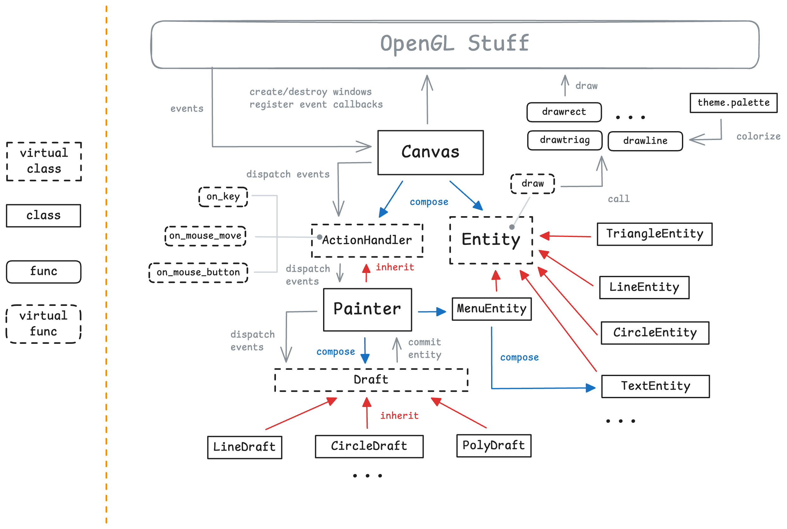
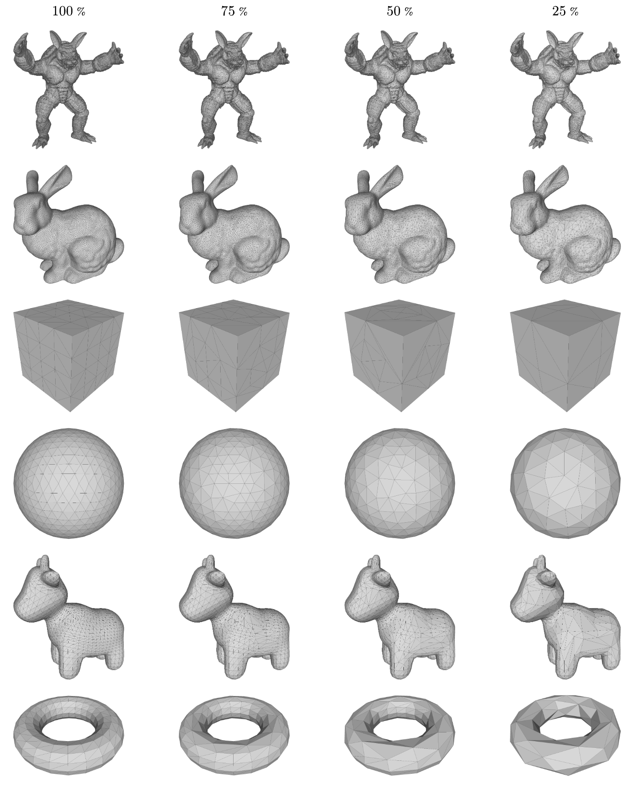
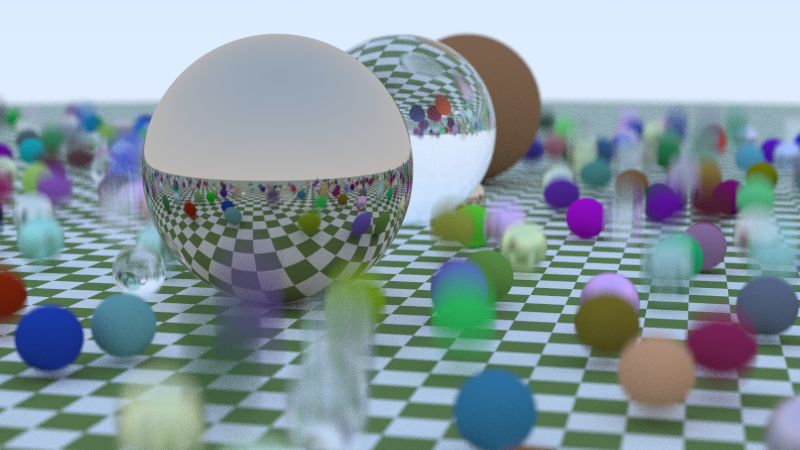
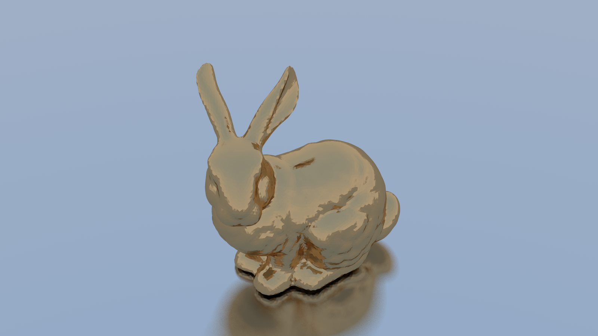
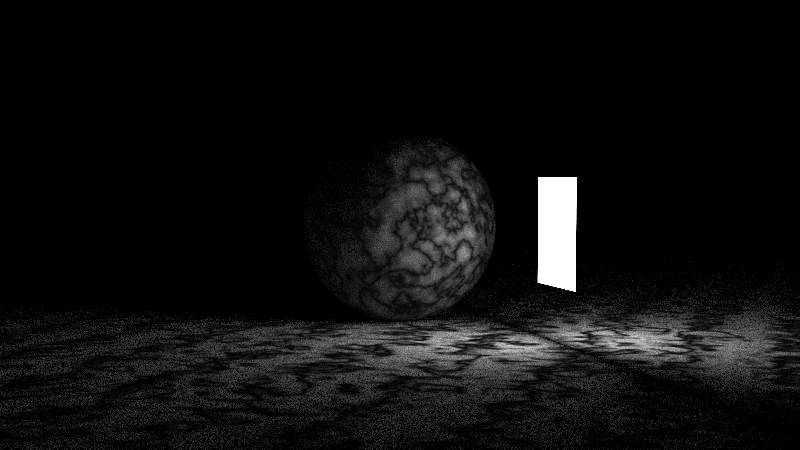
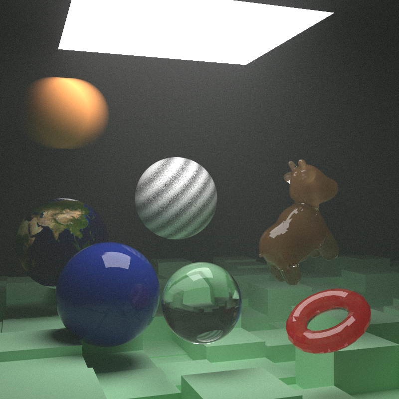
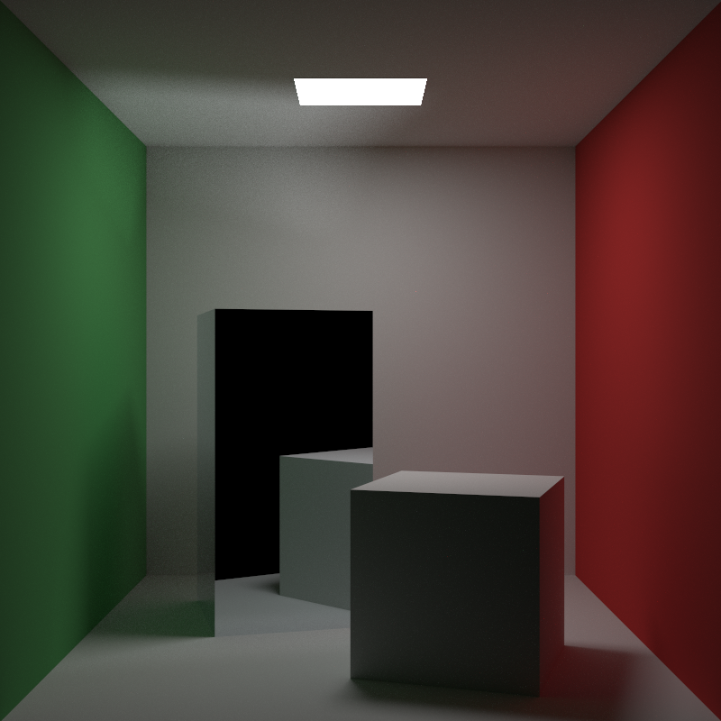
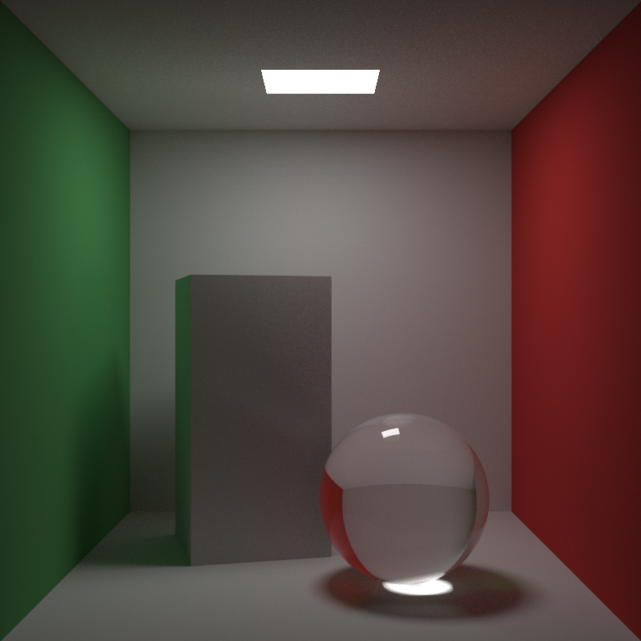
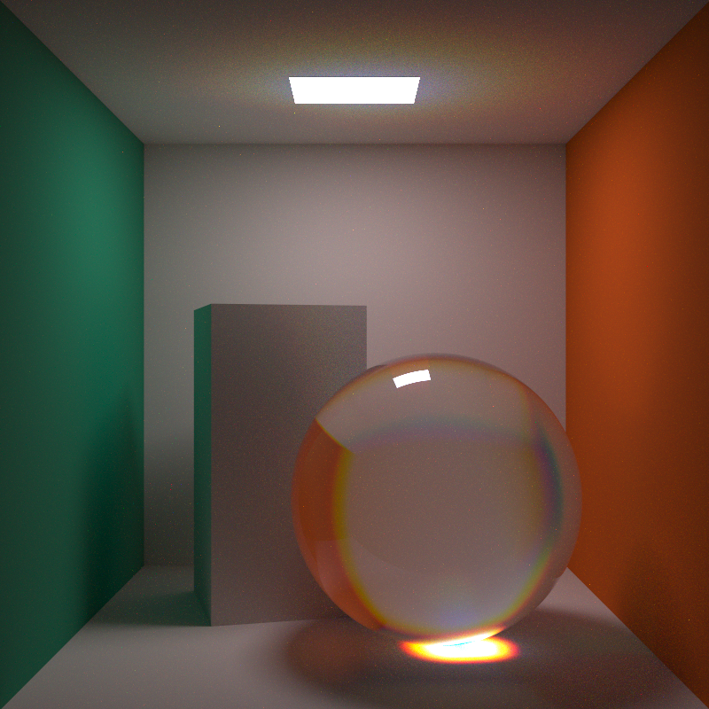

# CG Lab of UCAS

## build & run

```
xmake
xmake run project1
# xmake run project2
# ...
```

## reports

(typst source in `docs/src/*`)

- [Project1: OpenGL Basics](docs/p1-basics.pdf)

  

- [Project2: Mesh Simplification](docs/p2-mesh.pdf)

  

- [Project3: Ray Tracing](docs/p3-ray.pdf)
  
  > [!note]
  > For these demos, please checkout at `rgb` branch

  

  

  

  

  

  

  > [!note]
  > For this demo, please checkout at `master`

  
